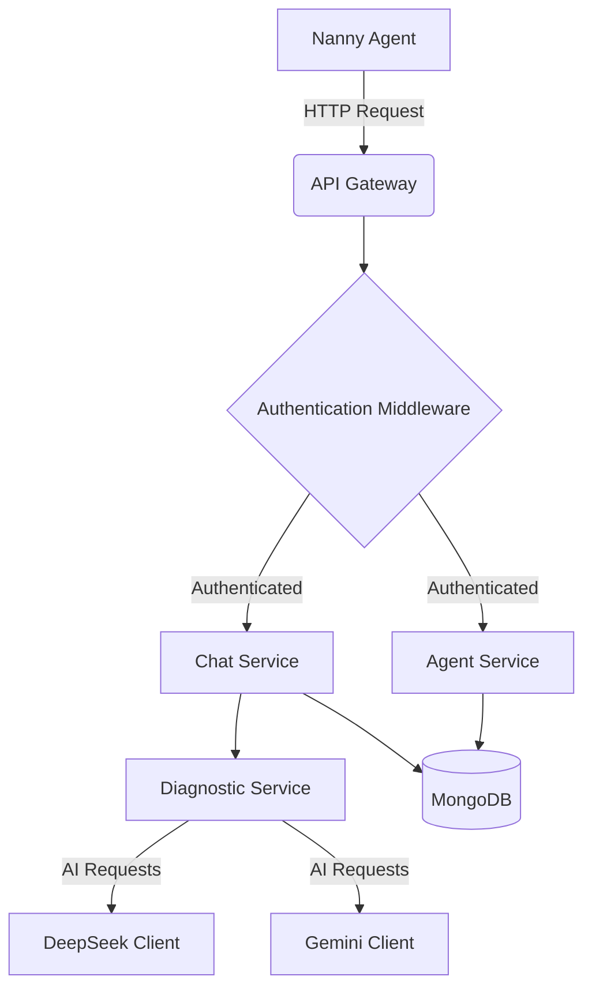
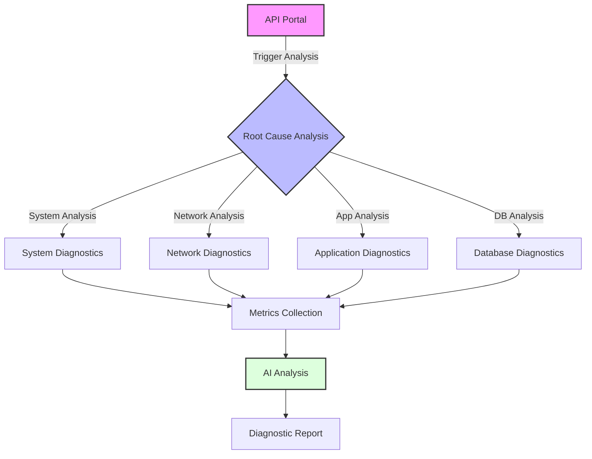

# nannyapi

[](https://github.com/harshavmb/nannyapi/actions/workflows/ci.yml)
[](https://codecov.io/gh/harshavmb/nannyapi)
[](https://goreportcard.com/report/github.com/harshavmb/nannyapi)
[](https://www.gnu.org/licenses/gpl-3.0)

This repo is an API endpoint service that receives prompts from nannyagents, does some preprocessing, and interacts with remote/self-hosted AI APIs to help answer prompts issued by nannyagents.

> **Note**: Currently optimized for Linux systems. Support for FreeBSD, Darwin & Windows Operating Systems is planned for future releases.

## Documentation

- [API Documentation](https://nannyai.dev/documentation)
- [Swagger Documentation](https://api.nannyai.dev/swagger)
- [Architecture Overview](./docs/ARCHITECTURE.md)

## Getting Started

To run the server, navigate to the project directory and execute the following command:

```bash
go run ./cmd/main.go
```

### Prerequisites

*   Go 1.24 or higher
*   MongoDB

### Installation

1.  Clone the repository:

    ```bash
    git clone https://github.com/harshavmb/nannyapi.git
    ```

2.  Navigate to the project directory:

    ```bash
    cd nannyapi
    ```

3.  Install dependencies:

    ```bash
    go mod tidy
    ```

### Configuration

The application relies on environment variables for configuration. You can set these variables in your shell or in a `.env` file.

#### Required Environment Variables

*   `MONGODB_URI`: The URI for your MongoDB instance. Example: `mongodb://localhost:27017`
*   `NANNY_ENCRYPTION_KEY`: The encryption key used for encrypting auth tokens.  Must be 32 bytes long.
*   `GH_CLIENT_ID`: Your GitHub OAuth client ID.
*   `GH_CLIENT_SECRET`: Your GitHub OAuth client secret.

#### Optional Environment Variables

*   `PORT`: The port the server listens on. Defaults to `8080`.
*   `GH_REDIRECT_URL`: The URL to redirect to after GitHub authentication. Defaults to `http://localhost:8080/github/callback`.
*   `SWAGGER_DOC_URL`: The URL to the Swagger documentation. Defaults to `http://localhost:8080/swagger/doc.json`.

### Running the Application

```bash
go run ./cmd/main.go
```

## API Endpoints

The API endpoints are documented using Swagger. All API interactions are logged for audit purposes.

### Authentication Endpoints
- `GET /github/login`: Initiates GitHub OAuth login
- `GET /github/callback`: GitHub OAuth callback handler
- `GET /github/profile`: Get GitHub profile information
- `POST /api/refresh-token`: Handle refresh token validation and creation

### User Management
- `GET /api/user/{id}`: Get user information
- `GET /api/user-auth-token`: Get user info from auth token

### Auth Token Management
- `POST /api/auth-token`: Create new auth token
- `GET /api/auth-tokens`: List all auth tokens
- `DELETE /api/auth-token/{id}`: Delete specific auth token

### Agent Management
- `POST /api/agent-info`: Register agent information
- `GET /api/agent-info/{id}`: Get specific agent information
- `GET /api/agents`: List all registered agents

### Chat Management
- `POST /api/chat`: Start new chat session
- `PUT /api/chat/{id}`: Add prompt-response to chat
- `GET /api/chat/{id}`: Get chat session details

### Diagnostic Endpoints
- `POST /api/diagnostic`: Start diagnostic session
- `POST /api/diagnostic/{id}/continue`: Continue diagnostic session
- `GET /api/diagnostic/{id}`: Get diagnostic session details
- `GET /api/diagnostic/{id}/summary`: Get diagnostic summary
- `DELETE /api/diagnostic/{id}`: Delete diagnostic session
- `GET /api/diagnostics`: List all diagnostic sessions

### Status
- `GET /status`: Get API service status

> **Security Note**: All API endpoints under `/api/` require authentication using either JWT Bearer token or API key.

## Audit Logging

Every interaction between agents and the API is comprehensively logged for audit purposes, including:
- All chat conversations
- Diagnostic sessions and their results
- System metric changes
- Authentication attempts
- Token creation/deletion events

Logs are stored in structured JSON format with timestamps and relevant metadata for easy analysis and compliance requirements.

## Architecture Diagrams

### Basic Flow


### Root Cause Analysis Flow


## Diagnostic Schema

```typescript
interface DiagnosticSession {
    id: string;
    agent_id: string;
    user_id: string;
    initial_issue: string;
    current_iteration: number;
    max_iterations: number;
    status: string;
    created_at: string;
    updated_at: string;
    initiator: "agent" | "portal";  // Source of diagnostic request
    history: DiagnosticResponse[];
}

interface DiagnosticResponse {
    diagnosis_type: "thread_deadlock" | "memory_leak" | "inode_exhaustion" |
                   "database" | "network" | "unsupported";
    commands: Array<{
        command: string;
        timeout_seconds: number;
        platform?: "linux" | "freebsd" | "darwin" | "windows";  // Platform-specific commands
    }>;
    log_checks: Array<{
        log_path: string;
        grep_pattern: string;
    }>;
    next_step: string;
    root_cause?: string;
    severity?: "high" | "medium" | "low";
    impact?: string;
    system_snapshot: SystemMetrics;
}

interface RootCausePortalRequest {
    issue: string;
    scope: {
        system?: boolean;    // OS-level diagnostics
        network?: boolean;   // Network connectivity and performance
        database?: boolean;  // Database performance and health
        app?: boolean;      // Application-specific checks
    };
    target_agents: string[];  // List of agent IDs to run diagnostics on
    correlation?: boolean;    // Whether to correlate results across agents
}

interface SystemMetrics {
    cpu_info: string[];
    cpu_usage: number;
    memory_total: number;
    memory_used: number;
    memory_free: number;
    disk_usage: { [mount_point: string]: number };
    fs_usage: { [mount_point: string]: string };
    platform: "linux" | "freebsd" | "darwin" | "windows";
}
```

## Tests

To run the tests, navigate to the project directory and execute the following command:

```bash
go test ./...
```

## Contributing

We welcome contributions! Please see [Contributors](./Contributors.md) for guidelines on how to contribute.

## License

This project is licensed under the GNU General Public License v3.0 - see the [LICENSE](https://www.gnu.org/licenses/gpl-3.0.html) file for details.
