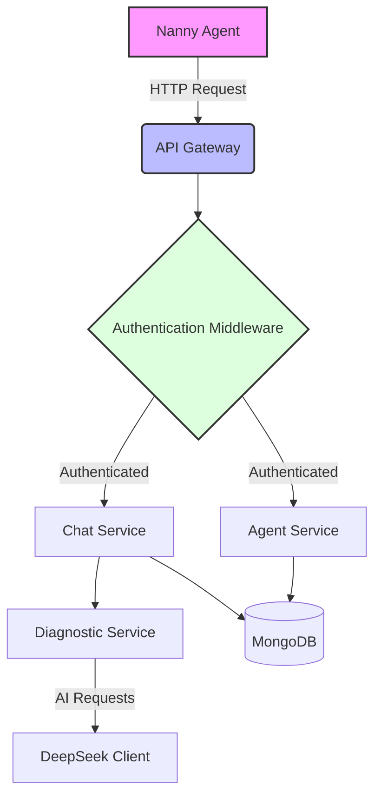
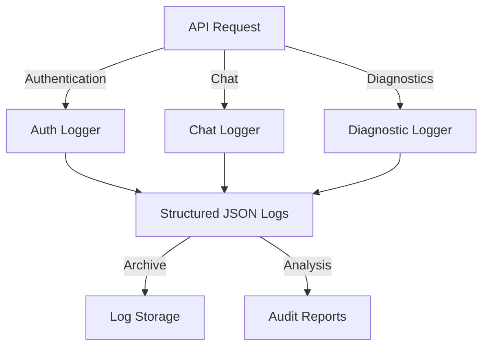
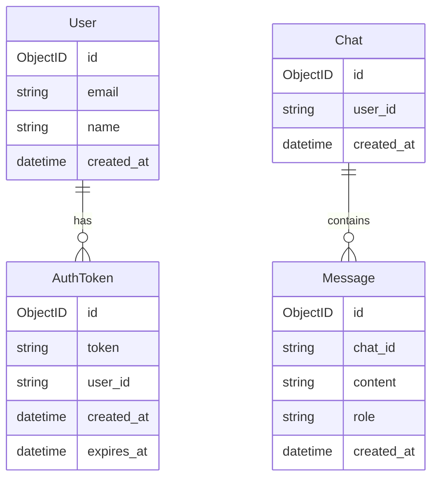

# NannyAPI Architecture

## System Overview

NannyAPI is a service that handles prompts from nanny agents, processes them, and interacts with various AI APIs to provide responses. The system is designed with a clean, modular architecture following Go best practices.

## Platform Support

Currently, the diagnostic capabilities are optimized for Linux systems. The roadmap for cross-platform support includes:

- **FreeBSD**: Support for FreeBSD-specific commands, metrics, and log locations
- **Darwin**: Support for macOS system diagnostics and performance metrics
- **Windows**: Support for Windows Event Logs, Performance Counters, and WMI queries

Each platform will have its own diagnostic command set and system-specific checks while maintaining a consistent API interface.

## Architecture Diagram

## Core Components

### 1. Server Layer (`internal/server/`)
- Handles HTTP routing and request processing
- Implements middleware for authentication and logging
- Manages API endpoint versioning
- Provides Swagger documentation

### 2. Authentication (`internal/auth/`)
- GitHub OAuth integration
- Token-based authentication
- Session management

### 3. Chat Service (`internal/chat/`)
- Manages chat sessions
- Processes user prompts
- Coordinates with diagnostic service

### 4. Diagnostic Service (`internal/diagnostic/`)
- Integrates with AI providers (DeepSeek)
- Handles prompt preprocessing
- Manages AI response processing

### 5. Agent Service (`internal/agent/`)
- Manages agent information
- Handles agent registration and updates
- Tracks agent statistics

## Logging and Audit

The system implements comprehensive logging for audit purposes:

### Logged Information:
1. **Authentication Events**
   - Login attempts
   - Token creation/deletion
   - Session management

2. **Chat Interactions**
   - Complete conversation history
   - Timestamps and metadata
   - AI service interactions

3. **Diagnostic Sessions**
   - Command execution logs
   - System metric changes
   - Root cause analysis steps

4. **System Changes**
   - Resource utilization changes
   - Configuration modifications
   - Service state changes

## Data Flow

1. Client sends request → API Gateway
2. Authentication middleware validates token
3. Request routed to appropriate service
4. Service processes request
5. Response returned to client

## Database Schema

## Security Considerations

1. **Authentication**
   - Token-based authentication
   - GitHub OAuth integration
   - Secure session management

2. **Data Protection**
   - Encryption at rest
   - Secure communication channels
   - Token encryption

3. **API Security**
   - Rate limiting
   - Input validation
   - CORS configuration

## Configuration Management

The system uses environment variables for configuration:
- Database connections
- API keys
- Service endpoints
- Feature flags

## Monitoring and Logging

- Structured logging
- Request/Response tracking
- Error monitoring
- Performance metrics

## Testing Strategy

1. **Unit Tests**
   - Service layer tests
   - Repository tests
   - Helper function tests

2. **Integration Tests**
   - API endpoint tests
   - Database integration tests
   - External service mocks

3. **Performance Tests**
   - Load testing
   - Concurrency testing
   - Resource usage monitoring

## Deployment

The service is designed to be deployed as a containerized application, supporting:
- Docker containers
- Kubernetes orchestration
- Cloud-native scaling
- Zero-downtime deployments
