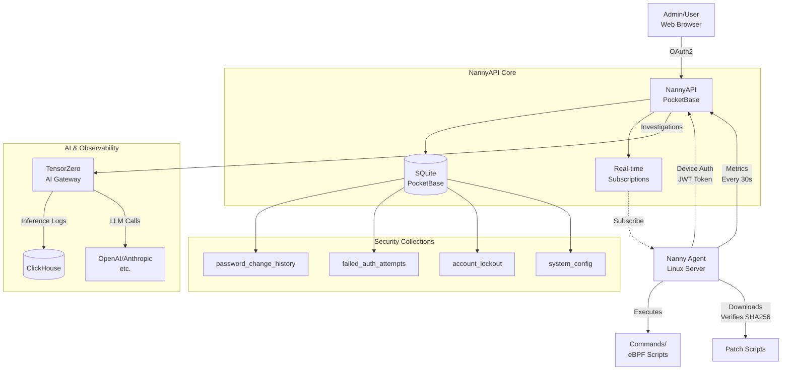
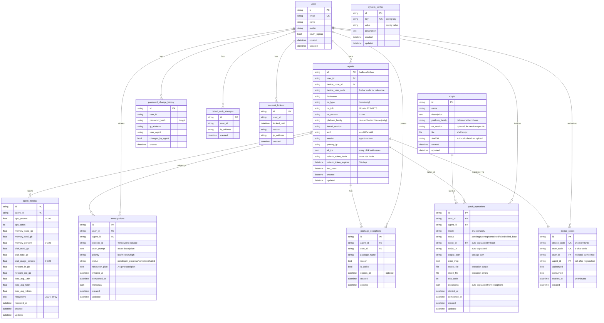

# NannyAPI Architecture

<p align="center">
  
</p>

## Project Evolution

> **Note**: NannyAPI was originally developed as a diagnostic agent leveraging AI for system troubleshooting. Over time, it evolved to support patch management, Proxmox integration, and comprehensive infrastructure monitoring. Future releases will introduce modularity, allowing the system to run without dependencies like TensorZero or ClickHouse based on user requirements and deployment scenarios.

## System Overview

NannyAPI is the central control plane for Nanny Agents. It provides:
- **Agent Registration & Authentication**: Secure device-based authentication flow for agents
- **System Monitoring**: Real-time metrics collection and health tracking
- **AI-Powered Investigations**: Automated system diagnostics using TensorZero AI gateway
- **Patch Management**: Secure, controlled package updates with integrity verification
- **Security Controls**: Password management, account lockout, and audit logging

**Supported Platforms**: Currently supports **Linux agents only** (amd64 and arm64 architectures). Additional platforms may be added based on user requests.

Built on **PocketBase**, NannyAPI leverages:
- SQLite for embedded database
- Built-in REST API with automatic CRUD operations
- Real-time subscriptions for agent communication
- OAuth2 authentication for user access

## Core Components

### 1. Authentication & Identity

#### User Authentication
- **OAuth2 Providers**: GitHub and Google OAuth2 for admin/developer access
- **Email/Password**: Standard authentication with password security controls
- **Password Security Features**:
  - Password change rate limiting (5 changes per 24 hours)
  - Password reuse prevention (24-hour history window)
  - Failed login tracking with account lockout (10 attempts → 24-hour lockout)
  - Password change audit trail with IP address and user agent

#### Agent Authentication (Device Authorization Flow)
NannyAPI implements a secure device authorization flow similar to OAuth2 device flow:

```flowchart
┌─────────┐                                    ┌──────────┐
│  Agent  │                                    │  API     │
└────┬────┘                                    └────┬─────┘
     │                                              │
     │  1. POST /api/agent (device-auth-start)     │
     │ ────────────────────────────────────────>   │
     │                                              │
     │  2. device_code, user_code, verification_uri│
     │ <────────────────────────────────────────   │
     │                                              │
     │         Display user_code to operator        │
     │                                              │
     
     ┌──────────┐                                   │
     │  User    │                                   │
     └────┬─────┘                                   │
          │                                         │
          │  3. Visit verification_uri              │
          │     Enter user_code                     │
          │ ─────────────────────────────────────>  │
          │                                         │
          │  4. POST /api/agent (authorize)         │
          │     Authorization: Bearer <user_token>  │
          │ ─────────────────────────────────────>  │
          │                                         │
          
     ┌────┴────┐                                    │
     │  Agent  │                                    │
     └────┬────┘                                    │
          │                                         │
          │  5. POST /api/agent (register)          │
          │     device_code + system info           │
          │ ─────────────────────────────────────>  │
          │                                         │
          │  6. access_token, refresh_token         │
          │ <─────────────────────────────────────  │
          │                                         │
```

**Key Points:**
- Device codes expire in 10 minutes
- User codes are 8-character alphanumeric codes (no ambiguous characters)
- Agents receive both access tokens (JWT from PocketBase) and refresh tokens
- Refresh tokens are stored as SHA-256 hashes and expire in 30 days
- Device codes are marked as consumed after successful registration

### 2. System Metrics & Monitoring

Agents report comprehensive system metrics every 30 seconds via `POST /api/agent` (action: `ingest-metrics`):

**Collected Metrics:**
- **CPU**: Usage percentage, core count, load averages (1min, 5min, 15min)
- **Memory**: Used/total in GB, usage percentage
- **Disk**: Used/total in GB, usage percentage, per-filesystem breakdowns
- **Network**: Cumulative inbound/outbound traffic in GB
- **System Info**: OS type, OS info, OS version, kernel version, architecture

**Agent Health Calculation:**
- `healthy`: Last seen < 5 minutes ago
- `stale`: Last seen 5-15 minutes ago
- `inactive`: Last seen > 15 minutes ago OR status = revoked/inactive

### 3. AI-Powered Investigations

Investigations use **TensorZero** as an AI gateway to diagnose system issues through an iterative feedback loop.

#### Investigation Lifecycle

```flowchart
┌──────────────────────────────────────────────────────────────┐
│                  INVESTIGATION WORKFLOW                       │
└──────────────────────────────────────────────────────────────┘

    User/Agent Initiates                  API Creates Record
    ─────────────────────────────────────────────────────────>
    Issue: "High CPU usage"               Status: pending
                                          episode_id: null
                                          
                    │
                    │  Agent Receives via Realtime
                    ▼
                    
         ┌──────────────────────────────┐
         │   DIAGNOSTIC LOOP (Iterative) │
         └──────────────────────────────┘
         
    ┌────────────────────────────────────────┐
    │  1. Agent Collects Context             │
    │     - System logs                      │
    │     - Process info                     │
    │     - Resource usage                   │
    └────┬───────────────────────────────────┘
         │
         │  POST to TensorZero (via proxy)
         ▼
    ┌────────────────────────────────────────┐
    │  2. TensorZero AI Analysis             │
    │     - Model: diagnose_and_heal         │
    │     - Returns: episode_id (1st time)   │
    │     - Response: DiagnosticResponse     │
    └────┬───────────────────────────────────┘
         │
         │  response_type: "diagnostic"
         ▼
    ┌────────────────────────────────────────┐
    │  3. AI Requests More Data              │
    │     - Commands: ["ps aux | grep java"] │
    │     - eBPF programs: [bpftrace script] │
    └────┬───────────────────────────────────┘
         │
         │  Agent executes commands
         ▼
    ┌────────────────────────────────────────┐
    │  4. Agent Sends Output Back            │
    │     - Command results                  │
    │     - eBPF trace output                │
    └────┬───────────────────────────────────┘
         │
         │  Loop continues until confident
         │
         ▼  response_type: "resolution"
         
    ┌────────────────────────────────────────┐
    │  5. Final Resolution Plan              │
    │     - Root cause identified            │
    │     - Resolution plan generated        │
    │     - Status: completed                │
    └────────────────────────────────────────┘
```

**TensorZero Response Types:**
1. **DiagnosticResponse** (`response_type: "diagnostic"`):
   - `reasoning`: AI's current hypothesis
   - `commands`: Shell commands to execute (read-only)
   - `ebpf_programs`: eBPF/bpftrace programs for kernel-level insights

2. **ResolutionResponse** (`response_type: "resolution"`):
   - `root_cause`: Root cause analysis
   - `resolution_plan`: Step-by-step remediation plan
   - `confidence`: High/Medium/Low
   - `ebpf_evidence`: Supporting evidence from eBPF monitoring

#### eBPF Deep Diagnostics

When standard metrics are insufficient, TensorZero can request eBPF programs:

**Example:**
```json
{
  "response_type": "diagnostic",
  "reasoning": "Possible disk I/O contention causing latency",
  "ebpf_programs": [{
    "name": "block_io_latency",
    "type": "bpftrace",
    "code": "tracepoint:block:block_rq_issue { @start[args->dev, args->sector] = nsecs; }",
    "duration": 10,
    "description": "Measure block I/O request latency"
  }]
}
```

### 4. Patch Management

Secure, controlled package updates with SHA-256 integrity verification.

#### Patch Operation Workflow

```flowchart
┌──────────────────────────────────────────────────────────────┐
│                  PATCH MANAGEMENT WORKFLOW                    │
└──────────────────────────────────────────────────────────────┘

    User Creates Patch                    API Process
    ─────────────────────────────────────────────────────────>
    POST /api/patches
    {
      "agent_id": "xxx",
      "mode": "dry-run"  // or "apply"
    }
    
                      │
                      │  1. Verify agent ownership
                      │  2. Determine platform_family (debian, rhel, etc.)
                      │  3. Find matching script in database
                      │  4. Create patch_operation record
                      │  5. Populate script_id, script_url, exclusions
                      ▼
                      
    ┌──────────────────────────────────────┐
    │  Patch Operation Created             │
    │  - Status: pending                   │
    │  - script_id: (auto-populated)       │
    │  - script_url: /api/files/...        │
    │  - exclusions: ["pkg1", "pkg2"]      │
    └──────┬───────────────────────────────┘
           │
           │  Agent receives via realtime subscription
           ▼
           
    ┌──────────────────────────────────────┐
    │  Agent Validates Script              │
    │  GET /api/scripts/{id}/validate      │
    │  Returns: { "sha256": "abc123..." }  │
    └──────┬───────────────────────────────┘
           │
           │  Download script
           ▼
    ┌──────────────────────────────────────┐
    │  Agent Downloads Script              │
    │  GET /api/files/scripts/{id}/{file}  │
    └──────┬───────────────────────────────┘
           │
           │  Verify SHA-256 hash
           │  If mismatch → ABORT
           ▼
    ┌──────────────────────────────────────┐
    │  Execute Script                      │
    │  ./apt-update.sh --dry-run           │
    │    --exclude pkg1,pkg2               │
    │                                      │
    │  Capture: stdout, stderr, exit_code  │
    └──────┬───────────────────────────────┘
           │
           │  Upload results
           ▼
    ┌──────────────────────────────────────┐
    │  Agent Reports Results               │
    │  POST /api/patches/{id}/result       │
    │  - stdout_file (attached)            │
    │  - stderr_file (attached)            │
    │  - exit_code                         │
    │  - Status: completed/failed          │
    └──────────────────────────────────────┘
```

**Patch Scripts:**
Located in `patch_scripts/` directory, organized by platform family:
- `debian/apt-update.sh`: Debian/Ubuntu systems
- `rhel/dnf-update.sh`: RHEL/CentOS/Fedora (DNF)
- `rhel/yum-update.sh`: Legacy RHEL/CentOS (YUM)
- `arch/pacman-update.sh`: Arch Linux
- `suse/zypper-update.sh`: SUSE/openSUSE

**Script Features:**
- `--dry-run`: Lists available updates without applying
- `--exclude pkg1,pkg2`: Excludes specific packages from updates
- JSON output for UI parsing
- Exit code reporting for success/failure detection

**Package Exceptions:**
Persistent exclusions stored in `package_exceptions` collection:
- `agent_id`: Target agent
- `package_name`: Package to exclude
- `reason`: Why it's excluded
- `is_active`: Active/inactive flag
- `expires_at`: Optional expiration date

Exceptions are automatically injected into patch operations during creation.

## Architecture Diagrams

### System Architecture



### Data Model (ERD)



### Security Configuration

Default security settings (stored in `system_config` collection):

| Key | Default Value | Description |
|-----|---------------|-------------|
| `security.password_change_limit_per_24h` | 5 | Max password changes per 24 hours |
| `security.password_history_window_hours` | 24 | Hours to check password reuse |
| `security.account_lockout_duration_hours` | 24 | Account lockout duration |
| `security.failed_login_attempts_limit` | 10 | Failed logins before lockout |

## Platform Support

### Operating Systems
**Linux Only** (currently supported)

Supported Linux distributions by package manager family:
- **Debian/Ubuntu** (apt) - `platform_family: debian`
- **RHEL/CentOS/Fedora/Rocky/AlmaLinux** (dnf/yum) - `platform_family: rhel`
- **Arch Linux/Manjaro** (pacman) - `platform_family: arch`
- **SUSE/openSUSE** (zypper) - `platform_family: suse`

> **Note**: Additional Linux distributions (Alpine, etc.) and other operating systems (macOS, Windows, FreeBSD) may be added based on user requests.

### Supported Architectures
- amd64 (x86_64)
- arm64 (aarch64)

## API Rules & Access Control

PocketBase provides built-in access control rules. NannyAPI implements:

### Users Collection
- **List**: `id = @request.auth.id` (users can only list themselves)
- **View**: `id = @request.auth.id` (users can only view themselves)
- **Create**: `""` (anyone can sign up)
- **Update**: `id = @request.auth.id` (users can only update themselves)
- **Delete**: `id = @request.auth.id` (users can only delete themselves)

### Agents Collection
- **List**: `user_id = @request.auth.id` (users see only their agents)
- **View**: `user_id = @request.auth.id`
- **Create**: `nil` (only via device auth flow)
- **Update**: `user_id = @request.auth.id`
- **Delete**: `user_id = @request.auth.id`

### Agent Metrics Collection
- **List**: `agent_id.user_id = @request.auth.id || agent_id = @request.auth.id`
- **View**: `agent_id.user_id = @request.auth.id || agent_id = @request.auth.id`
- **Create**: `agent_id.user_id = @request.auth.id || agent_id = @request.auth.id`
- **Update**: `agent_id.user_id = @request.auth.id || agent_id = @request.auth.id`
- **Delete**: `agent_id.user_id = @request.auth.id`

### Investigations Collection
- **All**: `user_id = @request.auth.id || agent_id = @request.auth.id`

### Patch Operations Collection
- **All (except Delete)**: `user_id = @request.auth.id || agent_id = @request.auth.id`
- **Delete**: `user_id = @request.auth.id` (only users can delete)

### Scripts Collection
- **List/View**: `@request.auth.id != ''` (any authenticated user/agent)

### Security Collections
All security-related collections (password history, failed attempts, lockouts, config) have `nil` rules - only accessible by superusers.

## External Dependencies

### Required
- **PocketBase**: Embedded (included in binary)
- **SQLite**: Embedded (included in PocketBase)

### Optional (Recommended for Production)
- **TensorZero**: AI gateway for investigations
  - Installation: https://www.tensorzero.com/docs
  - Required for: Investigation AI analysis
  - API URL configured via: `TENSORZERO_API_URL`, `TENSORZERO_API_KEY`

- **ClickHouse**: Observability data storage
  - Required for: AI inference history and episode tracking
  - Configuration: `CLICKHOUSE_URL`, `CLICKHOUSE_DATABASE`, `CLICKHOUSE_USER`, `CLICKHOUSE_PASSWORD`
  - Note: Currently required for fetching inference history; future releases will make this fully optional

### OAuth2 Providers
- **GitHub**: `GITHUB_CLIENT_ID`, `GITHUB_CLIENT_SECRET`
- **Google**: `GOOGLE_CLIENT_ID`, `GOOGLE_CLIENT_SECRET`

## Deployment Considerations

### File Storage
- PocketBase stores uploaded files in `pb_data/storage/`
- Scripts are stored in collection-specific directories
- Patch operation results (stdout/stderr) are stored as file attachments

### Database Backups
- SQLite database location: `pb_data/data.db`
- Backup strategy: Regular SQLite backups or replication
- PocketBase supports automatic backups via configuration

### Scaling Considerations
- Single-server deployment supported out of the box
- Real-time subscriptions scale to ~10k concurrent connections per instance
- For larger deployments, consider:
  - Load balancer with sticky sessions for real-time
  - Shared storage for `pb_data/`
  - External database (PocketBase supports PostgreSQL with commercial license)

## Security & System Prompts

**System Prompts for AI Investigations:**
- Core system prompts that govern AI behavior are **NOT public**
- Reason: Prevent prompt injection attacks and unauthorized overwrites
- Access: Self-hosted users can request prompts by contacting `support@nannyai.dev`
- Future: Will be made public after comprehensive adversarial testing

## Development & Testing

### Local Development Setup
```bash
# Clone repository
git clone https://github.com/nannyagent/nannyapi.git
cd nannyapi

# Set environment variables
cp .env.example .env
# Edit .env with your OAuth2 credentials

# Build
go build -o nannyapi

# Run migrations and start
./nannyapi serve --dir="./pb_data" --http="0.0.0.0:8090"
```

### Creating Admin User
```bash
./nannyapi superuser upsert admin@nannyapi.local AdminPass-123
```

### Testing
```bash
# Run all tests
go test ./tests/...

# Run specific test
go test ./tests/ -run TestAgentRegistration
```

## Monitoring & Observability

### Health Checks
- PocketBase built-in: `GET /api/health`
- Agent health endpoint: `POST /api/agent` (action: `health`)

### Metrics
- Agent metrics stored in `agent_metrics` collection
- Queryable via REST API or SQL
- Real-time updates via subscriptions

### Logging
- PocketBase logs: stdout/stderr
- Security events: Stored in dedicated collections
- Investigation traces: ClickHouse (if configured)

### Cleanup Jobs
- Device codes: Hourly cleanup of expired/consumed codes (running via goroutine)
- Old metrics: Manual cleanup recommended via SQL or custom script

## Related Documentation

- [Installation Guide](INSTALLATION.md): Binary installation, systemd setup
- [API Reference](API_REFERENCE.md): Complete API documentation
- [Patch Management](PATCHING.md): Detailed patch workflow
- [Security Policy](SECURITY.md): Vulnerability reporting, AI safety
- [Contributing](CONTRIBUTING.md): Development guidelines
