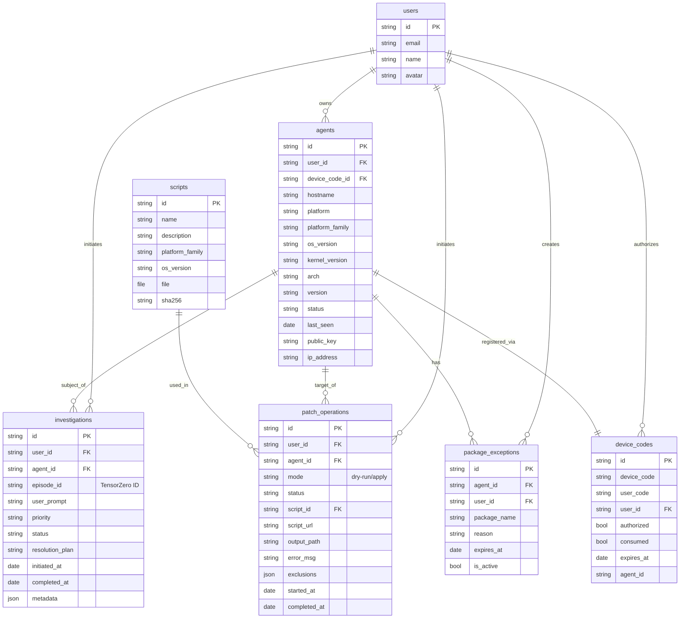

# NannyAPI Architecture

## System Overview

NannyAPI is the central control plane for Nanny Agents. It handles agent registration, authentication, investigation orchestration, and patch management. The system is built on top of PocketBase, providing a robust backend with real-time capabilities.

## Core Components

### 1. Authentication & Identity
The system supports multiple authentication methods:
- **OAuth2**: Native support for Google and GitHub OAuth providers for user access (Admins/Devs).
- **Agent Authentication**: Token-based authentication for agents.

### 2. AI & Observability Stack
To provide advanced AI capabilities and deep observability, NannyAPI integrates with:

- **TensorZero**: Used as the AI Gateway and LLM orchestration layer. It handles prompt management, model routing, and inference.
  - *Installation*: Please refer to the [TensorZero Documentation](https://www.tensorzero.com/docs) for installation instructions.
  
- **ClickHouse**: Used for high-performance observability data storage.
  - It stores **AI inference logs** and **episodes** generated by TensorZero.
  - **Note**: Currently, ClickHouse is required if you want to fetch AI inference history and episodes. Future releases will make this completely optional, but running without it is currently untested.

### 3. Investigation Workflow

Investigations follow an iterative diagnostic loop before a final resolution is reached.

#### Initiation
1. **Portal Initiated**: Admin triggers investigation -> API creates record -> Agent picks up request.
2. **Agent Initiated**: Agent detects anomaly -> Sends request to API.

#### Diagnostic Loop (Iterative)
1. **Context Collection**: Agent collects initial logs/metrics.
2. **AI Analysis**: Context sent to TensorZero.
3. **Hypothesis & Triage**: AI generates a hypothesis and may request specific **commands** or **eBPF programs** to verify it.
4. **Execution**: Agent executes the safe read-only commands/scripts.
5. **Feedback**: Output is sent back to AI.
6. **Repeat**: This cycle continues until the AI has sufficient confidence.

#### Resolution
Only after the diagnostic loop is complete does the AI generate a final **Resolution Plan**.
- This plan contains the root cause analysis and recommended remediation steps.
- It is stored in the `resolution_plan` field of the investigation record.

### 4. Advanced Diagnostics with eBPF

NannyAPI leverages **bpftrace** for deep system introspection. When standard logs and metrics are insufficient, the AI can generate safe, read-only bpftrace scripts to gather kernel-level insights.

**Example Workflow:**
1. **Issue**: "Application is slow but CPU is low."
2. **AI Hypothesis**: "Possible disk I/O latency or lock contention."
3. **Action**: AI generates a bpftrace one-liner:
   ```bash
   bpftrace -e 'tracepoint:block:block_rq_issue { @ = hist(args->bytes); }'
   ```
4. **Execution**: Agent runs the script for a limited duration (e.g., 10s).
5. **Analysis**: The histogram output is sent back to the AI to confirm if I/O size is the bottleneck.

### 5. Virtualization Support (Proxmox)

NannyAPI includes specialized support for Proxmox VE environments.
- **Host Agents**: Run on Proxmox nodes to monitor the hypervisor.
- **Guest Patching**: Supports agentless patching of LXC containers directly from the host.
- **Topology**: Maintains relationships between Clusters, Nodes, and Guests.

For detailed architecture of the Proxmox integration, see **[Proxmox Integration](PROXMOX.md)**.

### 6. Security & System Prompts

To ensure the safety and reliability of the AI agents:

- **System Prompts**: The core system prompts that govern the AI's behavior are **NOT public**. This is to prevent prompt injection attacks and unauthorized overwrites.
- **Access**: Users wishing to run NannyAPI in a self-hosted environment can request a copy of the system prompts by writing to `support@nannyai.dev`.
- **Future Availability**: Once we have confidently verified the prompts against adversarial attacks and established robust verification mechanisms, they will be made public.

## Architecture Diagram

```mermaid
graph TD
    User["Admin/User"] -->|OAuth (Google/GitHub)| API["NannyAPI (PocketBase)"]
    Agent["Nanny Agent"] -->|Auth Token| API
    
    subgraph "AI & Data Layer"
        API -->|Inference Requests| TZ[TensorZero]
        API -->|Observability Data| CH[(ClickHouse)]
        TZ -->|LLM Calls| LLM[LLM Providers]
    end

    subgraph "Agent Execution"
        Agent -->|1. Report Issue| API
        API -->|2. Send Plan| Agent
        Agent -->|3. Exec Commands/eBPF| System[Host System]
        System -->|4. Result| Agent
    end
```

## Database Schema

The following Entity Relationship Diagram (ERD) illustrates the relationships between the core collections in PocketBase.



### Collection Details

#### `users`
Standard PocketBase users collection.

#### `device_codes`
Used for the agent device authentication flow. Links a temporary code to a user and eventually to an agent.

#### `agents`
Registered Nanny Agents. Contains system metadata and status.

#### `investigations`
Incident records. Links an agent to a TensorZero `episode_id` for AI context.

#### `scripts`
Versioned patch scripts. Stored with SHA256 hashes for integrity verification.

#### `patch_operations`
Records of patch jobs. Tracks the execution of a script on an agent, including mode (dry-run/apply) and output.

#### `package_exceptions`
Persistent package exclusions for agents. Used to prevent specific packages from being updated during patch operations.

## Platform Support

Currently, the diagnostic capabilities are optimized for Linux systems. The roadmap includes support for FreeBSD, Darwin (macOS), and Windows.
