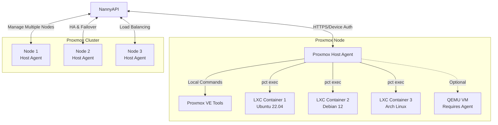
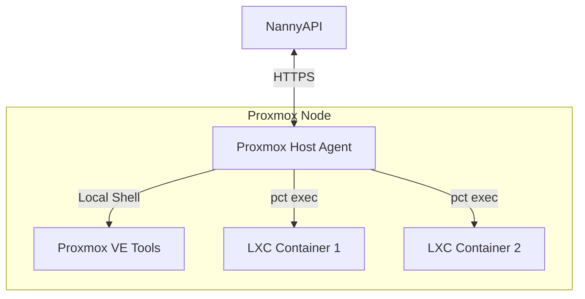

# Proxmox Integration

<p align="center">
  
</p>

NannyAPI provides specialized support for Proxmox VE environments, enabling comprehensive observability and patch management for both the host nodes and their guest containers (LXC). This integration allows centralized management of Proxmox infrastructure without requiring agents inside every container.

## Overview

Proxmox Virtual Environment (Proxmox VE) is a popular open-source server virtualization platform that combines KVM hypervisor and LXC containers. NannyAPI's Proxmox integration provides:

- **Agentless LXC Container Management**: Patch and monitor containers without installing agents inside them
- **Host-Level Monitoring**: Track Proxmox host metrics, cluster status, and resource usage
- **Topology Mapping**: Automatically discover and map relationships between hosts and guests
- **Unified Dashboard**: View entire Proxmox infrastructure from NannyAPI
- **Secure Patching**: Apply updates to hosts and containers with SHA-256 verification

## Architecture

The integration relies on the Nanny Agent running on the Proxmox host (Hypervisor). The agent leverages Proxmox's native CLI tools (`pct`, `qm`, `pvesh`) to interact with guests without requiring SSH access or additional agents.



### How It Works

1. **Single Agent per Host**: Install one Nanny Agent on each Proxmox node
2. **Guest Discovery**: Agent queries Proxmox API to discover all containers and VMs
3. **Metadata Collection**: Gathers guest IDs, names, IPs, OS types, and status
4. **Agentless Execution**: Uses `pct exec` to run commands inside LXC containers
5. **Centralized Reporting**: All data flows back to NannyAPI for unified visibility

## Installation on Proxmox Host

### Prerequisites

- Proxmox 8.0+ (older versions are untested)
- Root access to Proxmox host
- Network connectivity to NannyAPI server

### Step 1: Install Nanny Agent on Proxmox Host

```bash
# SSH into your Proxmox node
ssh root@proxmox-node-01

# Install the agent
curl -sL https://github.com/nannyagent/nannyagent/releases/latest/download/install.sh | bash

# Or download manually
wget https://github.com/nannyagent/nannyagent/releases/latest/download/nannyagent-linux-amd64
chmod +x nannyagent-linux-amd64
mv nannyagent-linux-amd64 /usr/local/bin/nannyagent
```

### Step 2: Configure Agent

Create configuration file:

```bash
cat > /etc/nannyagent/config.yml <<EOF
api_url: https://nannyapi.example.com
proxmox_mode: true
guest_discovery_interval: 300  # Discover guests every 5 minutes
metrics_interval: 30           # Report metrics every 30 seconds
EOF
```

### Step 3: Register with NannyAPI

```bash
# Start device authorization flow
nannyagent register --api-url https://nannyapi.example.com

# Follow the prompts to complete authorization
# The agent will detect it's running on Proxmox and enable host mode
```

The agent automatically detects Proxmox by checking for:
- `/usr/bin/pct` (LXC container management)
- `/usr/bin/qm` (QEMU VM management)
- `/etc/pve/` (Proxmox configuration directory)

### Step 4: Enable systemd Service

```bash
# Create systemd service
cat > /etc/systemd/system/nannyagent.service <<EOF
[Unit]
Description=Nanny Agent - Proxmox Host
After=network-online.target pve-cluster.service
Wants=network-online.target

[Service]
Type=simple
User=root
ExecStart=/usr/local/bin/nannyagent run --config /etc/nannyagent/config.yml
Restart=on-failure
RestartSec=10

[Install]
WantedBy=multi-user.target
EOF

# Enable and start
systemctl daemon-reload
systemctl enable nannyagent
systemctl start nannyagent

# Check status
systemctl status nannyagent
```

## Data Collection

The agent running on a Proxmox node collects comprehensive metadata to build relationships between the host and its guests.

### Host-Level Metrics

**System Metrics** (every 30 seconds):
- CPU usage percentage and core count
- Memory used/total, swap usage
- Disk usage per mount point
- Network traffic (inbound/outbound)
- Load averages (1m, 5m, 15m)
- Uptime

**Proxmox-Specific Metrics**:
- Cluster name and node name
- Node status (online, offline, maintenance)
- Quorum status (in clustered setups)
- Number of running containers/VMs
- Aggregate resource usage (sum of all guests)
- Storage pool usage (local, Ceph, NFS, etc.)
- High Availability (HA) status

### Guest Discovery

The agent periodically queries Proxmox CLI tools to discover all guests:

**LXC Containers** (`pct list`):
```bash
# Agent executes:
pct list --full

# Returns:
# VMID  Status    Name            IP Address      OS
# 100   running   web-server-01   192.168.1.100   Ubuntu 22.04
# 101   running   db-server-01    192.168.1.101   Debian 12
# 102   stopped   test-container  -               Arch Linux
```

**QEMU VMs** (`qm list`):
```bash
# Agent executes:
qm list

# Returns:
# VMID  Name          Status   Mem    CPU
# 200   windows-srv   running  8192   4
# 201   k8s-node-01   running  4096   2
```

**Collected Guest Metadata**:
- **VMID**: Proxmox virtual machine ID
- **Name**: Container/VM name
- **Status**: running, stopped, paused
- **IP Address**: Primary IP (from Proxmox DHCP leases or guest agent)
- **OS Type**: Detected OS distribution (debian, rhel, arch, suse)
- **MAC Address**: For network tracking
- **CPU/Memory Allocation**: Configured resources
- **Storage**: Disk size and mount points
- **Parent Host**: Link back to Proxmox host agent

This data allows NannyAPI to map the topology: **Cluster → Node → Guest**.

### Guest OS Detection

For LXC containers, the agent reads `/etc/os-release` inside the container:

```bash
# Agent executes:
pct exec 100 -- cat /etc/os-release

# Parses output to determine:
# - Distribution (Ubuntu, Debian, Arch, SUSE)
# - Version (22.04, 12, etc.)
# - Platform family (debian, rhel, arch, suse)
```

This OS detection enables automatic script selection for patching.

## Patch Management

### Host Patching

The Proxmox host itself runs Debian Linux. The agent patches it using the standard `apt` workflow:

1. **Dry-Run First** (recommended):
   ```bash
   # From NannyAPI UI or API:
   POST /api/patches
   {
     "agent_id": "proxmox-host-01",
     "mode": "dry-run"
   }
   ```

2. **Review Output**: Check which packages will be updated

3. **Apply Updates**:
   ```bash
   POST /api/patches
   {
     "agent_id": "proxmox-host-01",
     "mode": "apply"
   }
   ```

**Proxmox-Specific Considerations**:
- Uses `apt-get dist-upgrade` for kernel updates
- Automatically holds `pve-*` packages if configured
- Reboots can be scheduled via maintenance windows
- Cluster-aware: Can patch nodes sequentially to maintain quorum

**Package Exceptions**:
Common packages to exclude on Proxmox hosts:
- `pve-kernel-*` (hold kernel until planned reboot)
- `proxmox-ve` (hold meta-package for stability)
- `pve-manager` (hold until maintenance window)

Example creating persistent exceptions:
```bash
POST /api/packages/exceptions
{
  "agent_id": "proxmox-host-01",
  "package_names": ["pve-kernel-5.15", "pve-manager"],
  "reason": "Hold until scheduled maintenance window"
}
```

### LXC Guest Patching (Agentless)

**This is the killer feature**: Patch LXC containers **without installing an agent inside them**.

#### How Agentless Patching Works

1. **User Initiates Patch**: From NannyAPI, user selects an LXC container
   ```bash
   POST /api/patches
   {
     "agent_id": "lxc-100-web-server",  # Represents the container
     "mode": "dry-run"
   }
   ```

2. **NannyAPI Routes to Host**: API recognizes this is an LXC guest and sends the patch job to the **parent host agent**

3. **Script Selection**: NannyAPI selects the appropriate script based on the container's OS:
   - Ubuntu/Debian container → `apt-update.sh`
   - RHEL/CentOS container → `dnf-update.sh`
   - Arch container → `pacman-update.sh`
   - SUSE container → `zypper-update.sh`

4. **Host Agent Executes in Container**:
   ```bash
   # Agent executes on Proxmox host:
   pct exec 100 -- bash -c "$(cat /tmp/apt-update.sh)"
   
   # Or for more complex scripts:
   pct push 100 /tmp/apt-update.sh /tmp/patch.sh
   pct exec 100 -- bash /tmp/patch.sh --dry-run --exclude nginx,mysql
   pct exec 100 -- rm /tmp/patch.sh
   ```

5. **Output Captured**: stdout/stderr from inside the container is captured by the host agent

6. **Results Reported**: Agent uploads results back to NannyAPI:
   ```json
   {
     "operation_id": "patch-123",
     "exit_code": 0,
     "stdout": "10 packages will be upgraded...",
     "stderr": "",
     "completed_at": "2025-12-30T10:15:00Z"
   }
   ```

#### Container OS Detection

Before patching, the agent must know the container's OS:

```bash
# Agent queries Proxmox:
pct config 100 | grep ostype
# Returns: ostype: ubuntu

# Agent validates by reading os-release:
pct exec 100 -- cat /etc/os-release
# Parses to determine platform_family: debian
```

This detection happens during guest discovery and is cached in NannyAPI.

#### Example: Patching Ubuntu Container

**Dry-Run**:
```bash
curl -X POST https://nannyapi.example.com/api/patches \
  -H "Authorization: Bearer $TOKEN" \
  -d '{
    "agent_id": "lxc-100-web-server",
    "mode": "dry-run"
  }'

# Behind the scenes:
# 1. API looks up: lxc-100 parent = proxmox-host-01
# 2. API sends to host agent with metadata: vmid=100, os=ubuntu
# 3. Host agent executes:
pct exec 100 -- apt-get update
pct exec 100 -- apt-get upgrade --dry-run -y
# 4. Output returned:
{
  "packages_to_upgrade": [
    "nginx (1.18.0 → 1.24.0)",
    "mysql-server (8.0.32 → 8.0.35)",
    "openssl (3.0.2 → 3.0.13)"
  ],
  "total_count": 3
}
```

**Apply Updates**:
```bash
curl -X POST https://nannyapi.example.com/api/patches \
  -H "Authorization: Bearer $TOKEN" \
  -d '{
    "agent_id": "lxc-100-web-server",
    "mode": "apply",
    "exclusions": ["nginx"]  # Hold nginx
  }'

# Executes:
pct exec 100 -- apt-mark hold nginx
pct exec 100 -- apt-get upgrade -y
pct exec 100 -- apt-mark unhold nginx

# Results:
{
  "exit_code": 0,
  "packages_upgraded": ["mysql-server", "openssl"],
  "packages_held": ["nginx"]
}
```

### VM Patching

For QEMU VMs, the "agentless" approach is **not recommended** for OS-level patching because:
- VMs are fully isolated (no direct filesystem access)
- `qm` commands don't provide shell access like `pct exec`
- Risks of corruption or state inconsistency

**Recommended Approach for VMs**:
1. Install Nanny Agent **inside the VM**
2. Register the VM agent normally with NannyAPI
3. Patch like any other standalone agent

**Optional VM-to-Host Mapping**:
- NannyAPI can link VM agents to their parent Proxmox host
- Enables topology view: "This VM is running on proxmox-node-02"
- Helps with capacity planning and HA decisions

## Topology Visualization

NannyAPI builds a hierarchical view of your Proxmox infrastructure:

```
Proxmox Cluster: "production-cluster"
├── Node: proxmox-node-01 (Host Agent: agent-abc123)
│   ├── LXC 100: web-server-01 (Ubuntu 22.04) [Agentless]
│   ├── LXC 101: db-server-01 (Debian 12) [Agentless]
│   └── VM 200: windows-server (Windows) [Requires Agent]
├── Node: proxmox-node-02 (Host Agent: agent-def456)
│   ├── LXC 102: cache-server (Arch Linux) [Agentless]
│   ├── LXC 103: monitoring (Ubuntu 22.04) [Agentless]
│   └── VM 201: k8s-node-01 (Rocky Linux) [Agent: agent-xyz789]
└── Node: proxmox-node-03 (Host Agent: agent-ghi012)
    ├── LXC 104: dns-server (Debian 12) [Agentless]
    └── LXC 105: proxy-server (Ubuntu 22.04) [Agentless]
```

### Dashboard Features

In NannyAPI UI, you can:
- **View by Cluster**: See all nodes in a Proxmox cluster
- **Drill Down by Node**: Click a node to see all its guests
- **Guest Status**: See which containers/VMs are running, stopped, or need patches
- **Resource Aggregation**: View total CPU/RAM/disk usage across all guests
- **Patch Status**: See which guests have pending updates
- **Relationship Graph**: Visualize host-guest relationships

## API Integration Examples

### List All Proxmox Hosts

```bash
GET /api/agents?filter=proxmox_role%3D%3D'host'

Response:
[
  {
    "id": "agent-abc123",
    "hostname": "proxmox-node-01",
    "os_type": "linux",
    "platform_family": "debian",
    "proxmox_role": "host",
    "proxmox_cluster": "production-cluster",
    "proxmox_node_name": "pve-01",
    "guest_count": 3,
    "last_seen": "2025-12-30T10:00:00Z"
  }
]
```

### List Guests for a Host

```bash
GET /api/agents?filter=proxmox_parent_host%3D%3D'agent-abc123'

Response:
[
  {
    "id": "guest-lxc-100",
    "name": "web-server-01",
    "proxmox_vmid": "100",
    "proxmox_type": "lxc",
    "proxmox_parent_host": "agent-abc123",
    "os_type": "linux",
    "platform_family": "debian",
    "status": "running",
    "ip_address": "192.168.1.100"
  }
]
```

### Patch All Containers on a Host

```bash
# Get all containers for a host
GET /api/agents?filter=proxmox_parent_host%3D%3D'agent-abc123'%26%26proxmox_type%3D%3D'lxc'

# Iterate and create patch operations
for guest_id in $(get_guest_ids); do
  POST /api/patches
  {
    "agent_id": "$guest_id",
    "mode": "dry-run"
  }
done
```

## Best Practices

### 1. Host Patching Strategy
- Always run dry-run first
- Patch one node at a time in clustered setups
- Ensure quorum is maintained (need n/2+1 nodes online)
- Schedule reboots during maintenance windows
- Test on non-production nodes first

### 2. LXC Container Management
- Enable automatic guest discovery (default: every 5 minutes)
- Use persistent package exceptions for containers with custom software
- Create container templates for common OS configurations
- Document which containers are agentless vs. have monitoring agents

### 3. Monitoring & Alerts
- Set up alerts for host high CPU/memory usage
- Monitor guest count changes (detect new/deleted containers)
- Track patch compliance across all containers
- Use NannyAPI investigations for host-level issues

### 4. Security Considerations
- Nanny Agent on host runs as root (required for `pct exec`)
- Limit network access from containers to NannyAPI
- Use firewall rules to restrict host access
- Regularly audit which containers have been patched
- Enable SHA-256 script verification (default)

### 5. Backup Before Patching
- Use Proxmox's built-in backup (`vzdump`)
- Snapshot containers before major updates
- Test restoration procedures
- Document rollback steps

## Limitations

### Current Limitations

1. **LXC Only for Agentless**: QEMU VMs require agents inside the guest
2. **Proxmox 7.0+**: Older versions may have incompatible `pct` CLI output
3. **Linux Guests Only**: No Windows container support (not a Proxmox limitation)
4. **Root Required**: Host agent must run as root for `pct exec` access
5. **No Nested Virtualization**: Agent doesn't handle nested Proxmox setups

### Planned Enhancements

- **Automatic Rollback**: Snapshot before patch, rollback on failure
- **Cluster Orchestration**: Intelligent node-by-node patching with HA awareness
- **Container Grouping**: Batch patch containers by application stack
- **VM Integration**: Explore QEMU guest agent integration for agentless VM patching
- **Storage Metrics**: Track Ceph, ZFS, LVM storage pool usage

## Troubleshooting

### Agent Can't Discover Guests

**Symptoms**: No containers shown in NannyAPI dashboard

**Solutions**:
```bash
# Check if Proxmox CLI tools work:
pct list
qm list

# Check agent logs:
journalctl -u nannyagent -f

# Verify Proxmox API is accessible:
pvesh get /nodes/$(hostname)/lxc
```

### Agentless Patching Fails

**Symptoms**: Patch operation returns error or hangs

**Solutions**:
```bash
# Test pct exec manually:
pct exec 100 -- whoami
# Should return: root

# Check container is running:
pct status 100

# Verify container has network access:
pct exec 100 -- ping -c 1 1.1.1.1

# Check if container filesystem is accessible:
pct exec 100 -- ls /etc/apt/sources.list
```

### Guest OS Detection Wrong

**Symptoms**: Wrong patch script selected for container

**Solutions**:
```bash
# Manually check container OS:
pct exec 100 -- cat /etc/os-release

# Update guest metadata in NannyAPI:
PATCH /api/agents/{guest_id}
{
  "platform_family": "debian"  # Correct value
}

# Force guest rediscovery:
systemctl restart nannyagent  # On Proxmox host
```

### Performance Impact

**Symptoms**: Proxmox host slow during metrics collection

**Solutions**:
```bash
# Reduce discovery frequency:
# Edit /etc/nannyagent/config.yml
guest_discovery_interval: 600  # 10 minutes instead of 5

# Reduce metrics frequency:
metrics_interval: 60  # 1 minute instead of 30 seconds

# Restart agent:
systemctl restart nannyagent
```

## Conclusion

NannyAPI's Proxmox integration provides powerful agentless management for LXC containers while maintaining full observability and patch management for Proxmox hosts. This approach significantly reduces operational overhead for teams managing dozens or hundreds of lightweight containers.

**Key Takeaways**:
- ✅ One agent per Proxmox host manages all LXC containers
- ✅ No need to install agents inside containers
- ✅ Automatic guest discovery and OS detection
- ✅ Secure patching with SHA-256 verification
- ✅ Unified dashboard for entire Proxmox infrastructure

For additional support or questions, see [CONTRIBUTING.md](CONTRIBUTING.md) or open an issue on GitHub.

## Architecture

The integration relies on the Nanny Agent running on the Proxmox host (Hypervisor).



## Data Collection

The agent running on a Proxmox node collects additional metadata to build relationships between the host and its guests.

### Host Data
- **Role**: Identified as a `proxmox-host`.
- **Cluster Info**: Cluster name, node status.
- **Resources**: Aggregate CPU/RAM usage of the node.

### Guest Discovery
The agent periodically queries the Proxmox API (or CLI tools like `pct list` and `qm list`) to discover running guests.
- **LXC Containers**: ID, Name, Status, IP Address, OS Type.
- **QEMU VMs**: ID, Name, Status.

This data allows NannyAPI to map the topology: `Cluster -> Node -> Guest`.

## Patch Management

### Host Patching
The Proxmox host itself is a Debian-based system. The agent patches it using the standard `apt` workflow, but with awareness of Proxmox-specific requirements (e.g., using `dist-upgrade` when appropriate, though standard updates are usually safe).

### LXC Guest Patching (Agentless)
A key feature is the ability to patch LXC containers **without installing an agent inside them**.

1. **Initiation**: The API sends a patch job to the **Host Agent**, specifying the target LXC ID (e.g., `100`).
2. **Execution**:
   - The Host Agent receives the job.
   - It downloads the appropriate patch script for the guest's OS (e.g., `apt-update.sh` for a Debian container).
   - It copies the script into the container or pipes it via `pct exec`.
   - **Command**: `pct exec <vmid> -- /bin/bash -c "..."`
3. **Reporting**: The output from inside the container is captured by the Host Agent and reported back to the API as the patch result.

This approach significantly reduces management overhead, as you don't need to maintain agents on hundreds of lightweight containers.

## VM Patching
For QEMU VMs, the "Agentless" approach via the host is generally not possible (or safe) for OS-level patching.
- **Recommendation**: Install the Nanny Agent inside the VM.
- **Relationship**: The API can link the VM-Agent to the Host-Agent based on UUIDs or manual mapping, allowing you to visualize which host a VM is running on.
