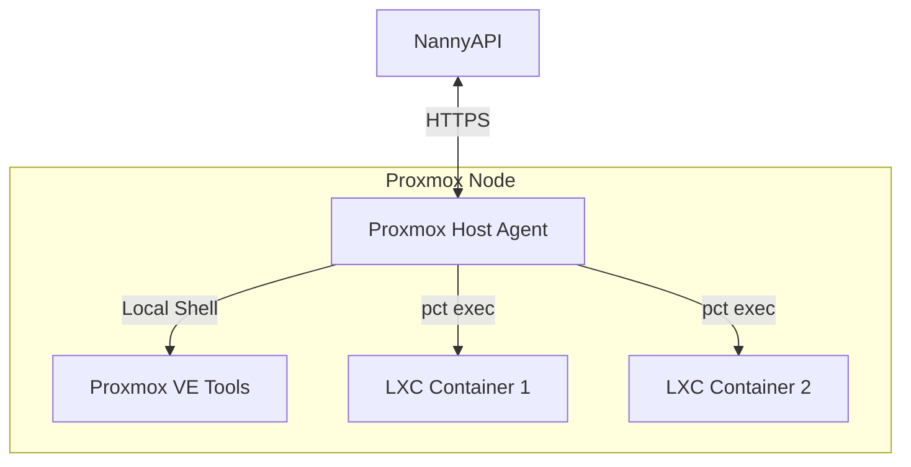

# Proxmox Integration

NannyAPI provides specialized support for Proxmox VE environments, enabling comprehensive observability and patch management for both the host nodes and their guest containers (LXC).

## Architecture

The integration relies on the Nanny Agent running on the Proxmox host (Hypervisor).

## Data Collection

The agent running on a Proxmox node collects additional metadata to build relationships between the host and its guests.

### Host Data
- **Role**: Identified as a `proxmox-host`.
- **Cluster Info**: Cluster name, node status.
- **Resources**: Aggregate CPU/RAM usage of the node.

### Guest Discovery
The agent periodically queries the Proxmox API (or CLI tools like `pct list` and `qm list`) to discover running guests.
- **LXC Containers**: ID, Name, Status, IP Address, OS Type.
- **QEMU VMs**: ID, Name, Status.

This data allows NannyAPI to map the topology: `Cluster -> Node -> Guest`.

## Patch Management

### Host Patching
The Proxmox host itself is a Debian-based system. The agent patches it using the standard `apt` workflow, but with awareness of Proxmox-specific requirements (e.g., using `dist-upgrade` when appropriate, though standard updates are usually safe).

### LXC Guest Patching (Agentless)
A key feature is the ability to patch LXC containers **without installing an agent inside them**.

1. **Initiation**: The API sends a patch job to the **Host Agent**, specifying the target LXC ID (e.g., `100`).
2. **Execution**:
   - The Host Agent receives the job.
   - It downloads the appropriate patch script for the guest's OS (e.g., `apt-update.sh` for a Debian container).
   - It copies the script into the container or pipes it via `pct exec`.
   - **Command**: `pct exec <vmid> -- /bin/bash -c "..."`
3. **Reporting**: The output from inside the container is captured by the Host Agent and reported back to the API as the patch result.

This approach significantly reduces management overhead, as you don't need to maintain agents on hundreds of lightweight containers.

## VM Patching
For QEMU VMs, the "Agentless" approach via the host is generally not possible (or safe) for OS-level patching.
- **Recommendation**: Install the Nanny Agent inside the VM.
- **Relationship**: The API can link the VM-Agent to the Host-Agent based on UUIDs or manual mapping, allowing you to visualize which host a VM is running on.
